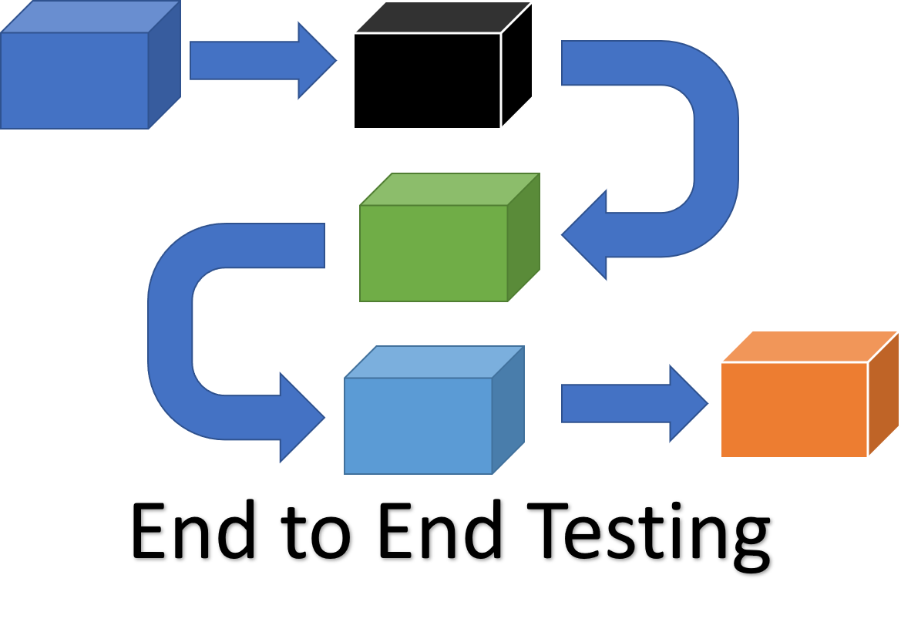
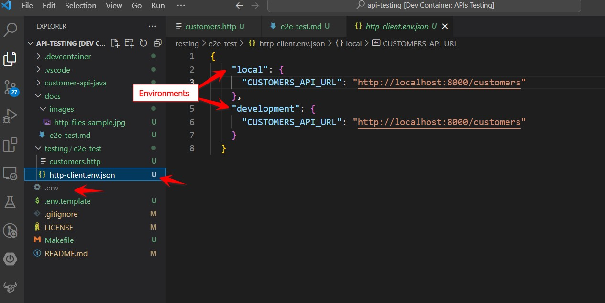
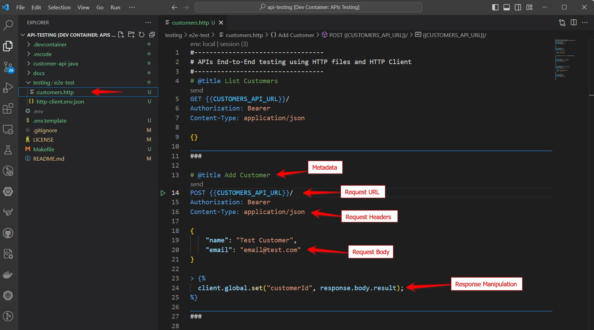
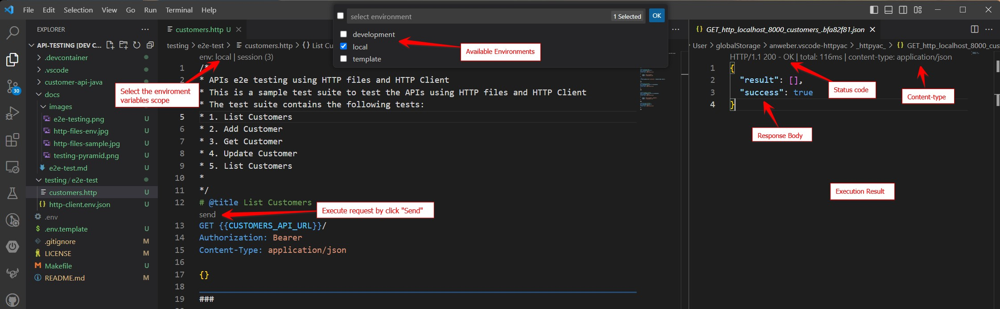
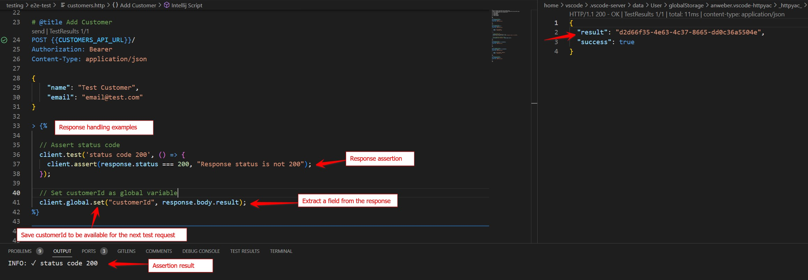
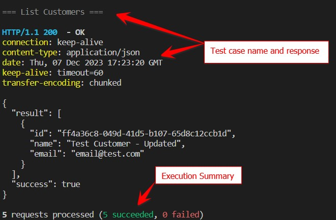

# APIs testing using HTTP files and Rest Client


## Context

During our last engagement with one of financial sector client and after finishing the first iteration of the API endpoints implementation, one of the tasks that we had to do was to test the API endpoints end-to-end to make sure that the APIs were working as expected and allows the developers to demonstrate there work by the end of each sprint. So we did a comparison between different tools for API testing and HTTP files (HTTP/Rest Client) is selected for this purpose.

Our selection criteria were:

- Learning curve and ease of use
- IDEs integration (Visual studio, VS Code, IntelliJ)
- CLI availability for Automation and CI/CD integration
- Integrated to the existing development process (PRs, Code review, source control, etc.)
- keep the testing process simple and easy to maintain
- Human readable and easy to understand
- Features
    - Support for different HTTP methods and Headers
    - Authentication support
    - Environment variables
    - Response validation and manipulation

I would like to walk you through the steps we took to perform end-to-end testing for the API endpoints in the solution.

In this article, we have developed sample mock Customer API endpoints using Spring Boot. I employ this setup to illustrate the process of conducting end-to-end testing, leveraging [VS Code](https://code.visualstudio.com/) as the integrated development environment (IDE) and  [Httpyac](https://marketplace.visualstudio.com/items?itemName=anweber.vscode-httpyac) as the HTTP client.

Please find all the code and documentation in the repository [here](https://github.com/ISE-Neutrino/api-testing)

## E2E(end-to-end) testing

Let's start by defining what is end-to-end testing and why we need to do it.

End-to-end testing is a methodology used to test whether the flow of an application is performing as designed from start to finish. The purpose of carrying out end-to-end tests is to identify system dependencies and to ensure that the right information is passed between various system components and systems.

I will focus in this article on testing API endpoints end-to-end, so I will not go into details about the end-to-end testing methodology and different strategies that can be used to do it.



## HTTP files

It is a file with a `.http` extension that allows you to write HTTP requests using a format that follows the standards of [RFC 9110 HTTP Semantics](https://www.rfc-editor.org/rfc/rfc9110.html). The file can be executed from IDEs like Visual Studio, VS Code, IntelliJ (natively or through HTTP clients extensions [Rest Client, Httpyac, Intellj HTTP Client]) or from the command line using the ([Httpyac CLI](https://httpyac.github.io/guide/installation_cli.html) - [HTTP Client CLI](https://www.jetbrains.com/help/idea/http-client-in-product-code-editor.html)).

IDEs integration allows you to send HTTP requests and view the response directly in Code editor without switching to a browser or a separate application.

As it is a text file, it can be easily integrated with the existing development process (PRs, code review, source control, etc.)

## Environment variables

Each IDE or Extension has its own way to define environment variables, but the concept is the same. Environment variables are used to define variables that can be used in the request URL, headers, and body. It is very useful to define the base URL of the API endpoints and the authentication token.

For Httpyac extension in VS Code, you use different sources of the environment variables:
 - System environment variables
 - Json Based environment variables file and you can define multiple environment per file

 

## Create HTTP request test

As presented by the image below, the HTTP request is composed of these parts:

- [Request line:](https://httpyac.github.io/guide/request.html#request-line) The first line of the request contains the HTTP method, the URL, and the HTTP version.
- [Headers:](https://httpyac.github.io/guide/request.html#headers) The request headers are used to pass additional information about the request, and about the client itself, to the server.
- [Body:](https://httpyac.github.io/guide/request.html#request-body) The request body is used to send data to the server.
- Metadata: Metadata is used to add additional information about the request, such as request name, title, etc.
- [Response Handling:](https://httpyac.github.io/guide/assert.html) The response handling section is used to write the required logic for response validation and handling.



 ## Execute the HTTP request

 Httpyac extension allows you to select the environment variables scope and use the `send` UI command to execute the HTTP request.

 


## Response handling and validation

The HTTP Client supports a mechanism to manipulate the response and validate it, by exposing the response as an object that can be used to access its response status, headers, and body.

In addition to a handy utility functions that can be used to validate the response and manipulate it.



## Test Automation 

The HTTP files can be executed from the command line using the [Httpyac CLI](https://httpyac.github.io/guide/installation_cli.html) or [HTTP Client CLI](https://www.jetbrains.com/help/idea/http-client-in-product-code-editor.html). This allows you to automate the test execution and can be integrated with CI/CD pipelines.


```bash
# Install Httpyac CLI
npm install -g httpyac

# Execute the HTTP file
# https://httpyac.github.io/guide/installation_cli.html
httpyac testing/e2e-test/customers.http --all -e local -o response
```



The sample repository contains `make commands` as shorthand to execute the HTTP files using the Httpyac CLI automatically.

```bash
# Install Httpyac CLI
make e2e-init

# Execute the HTTP file
make e2e-local
```

## Summary

In this article, we've demonstrated how to conduct end-to-end testing for API endpoints using HTTP files and Rest Clients. We utilized the Httpyac extension in VS Code as an HTTP client for composing and executing HTTP requests. Additionally, we illustrated how to employ environment variables to define the base URL of the API endpoints and the authentication token. 
We've also highlighted the usefulness of a response handling and validation mechanism.

## References

- [ISE E2e-testing](https://microsoft.github.io/code-with-engineering-playbook/automated-testing/e2e-testing/)
- [API Testing Tools](https://www.accelq.com/blog/api-testing-tools/)
- [Visual Studio Http files support](https://learn.microsoft.com/en-us/aspnet/core/test/http-files?view=aspnetcore-8.0)
- [VSCode Rest Client](https://marketplace.visualstudio.com/items?itemName=humao.rest-client)
- [VSCode Httpyac Rest Client](https://marketplace.visualstudio.com/items?itemName=anweber.vscode-httpyac)
- [Httpyac CLI](https://httpyac.github.io/guide/installation_cli.html)
- [IntelliJ Http Client](https://www.jetbrains.com/help/idea/http-client-in-product-code-editor.html)


