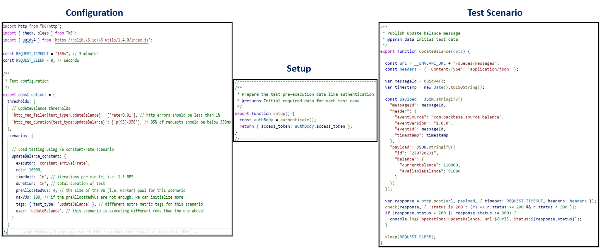

# Load Testing

Load testing is a type of performance testing that tests how the system behaves under varying load conditions, including the impact on responsiveness, throughput and resource utilization.

## Why

- Validate reliability under expected traffic.
- Discover bottlenecks and system limits under unusual traffic
- Which leads to Improve reliability and Release with confidence

## How

There are many tools available for load testing (Azure Load Testing - K6 – JMeter – Gatling - and more). Today I will focus on [k6](https://k6.io/).

## Metrics

- __Throughput:__ The number of requests per second that the system can handle.
- __Response time and Latency:__ The time it takes for the system to respond to a request.
- __Error rate:__ The percentage of requests that fail.

## When design your API tests

- What flows or components do you want to test?
- How will you run the test?
- What criteria determine acceptable performance? (SLOs)

## K6

K6 is an open-source load testing tool that simplifies performance testing for engineering teams, making it easy and productive. It is developer and source-control friendly and has a small learning curve (JavaScript). You can run k6 locally, in the cloud, or as part of your CI/CD pipeline.

- __Test types:__ Primarily designed for supporting performance testing types such as load, stress, spike, and more.
- __Target Users:__ Developers and performance engineers seeking a user-friendly, modern tool for effective performance testing.
- __Technology Stack:__ Uses JavaScript and ES6 for scripting, which is widely used.
- __Support:__ Offers community support and a commercial version (k6 Cloud) with additional features and support options.
- __Learning Curve:__ With a relatively low learning curve
- __Scalability:__ Designed for horizontal scaling, allowing you to easily distribute load tests across multiple machines.
- __Test Plans Source Control:__ Compatible with version control systems and follow the development process (Code review, Pull requests, etc.).
- __Metrics:__ Provides essential performance metrics out of the box, to track Throughput, Response time and Latency
- __Thresholds:__ Enables setting of performance thresholds based on your SLO requirements.
- __Automation CLI:__ Comes with a CLI for automation, simplifying running k6 locally, in the cloud, or as part of your CI/CD.
- __Cloud Native:__ Container-friendly, making it suitable for running in cloud environments and container orchestration platforms.
- __Supported Protocols:__ HTTP, WebSocket, gRPC
- __Observability Integration:__ send test results to Observability systems such as AppInsights, Datadog, Grafana, and more.

## Test Plan Structure



## Run the test

```bash
k6 run ./testing/load-test/customers-service.js
```

## Analyze the results


