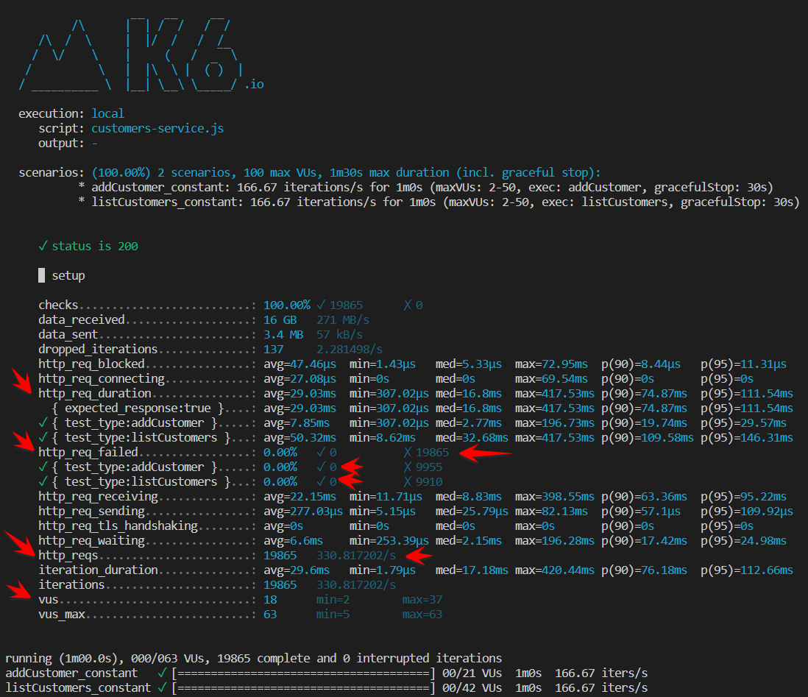

# APIs load testing using K6


## Context

After completing the initial phases of the API endpoints implementation, we need to plan how to test the performance, identify potential bottlenecks, and ensure that the system meets the SLOs (Service Level Objectives) requirements. Load testing is used for this purpose, on a recent engagement we evaluated different tools and decided to use [K6](https://k6.io/) for load testing, this post will go through the load testing concept and how to use the K6 framework to perform load testing for API endpoints. In this context, we have developed mock Customer API service using Spring Boot. this setup used to illustrate the process of conducting load-testing with [VS Code](https://code.visualstudio.com/) and [K6](https://grafana.com/docs/k6/latest/).

_You can find the sample source code and documentation in the following repository [here](https://github.com/ISE-Neutrino/api-testing)._

## Load testing

**Load testing** is a type of performance testing that tests how the system behaves under varying load conditions, including the impact on responsiveness, throughput and resource utilization.

**Why we need it:**

- Validate reliability under expected traffic
- Discover bottlenecks and system limits under unusual traffic.

**When you design your API tests, first you need to answer the following questions:**

- What flows or components do you want to test?
- How will you run the test?
- What criteria determine acceptable performance?

**The test goals determine the test type:**

- **Smoke test:** Verify the system functions with minimal load.
- **“Average” load test:** Discover how the system functions with typical traffic.
- **Stress test:** Discover how the system functions with the load of peak traffic.
- **Spike test:** Discover how the system functions with sudden and massive increases in traffic.
- **Breakpoint test:** Progressively ramp traffic to discover system breaking points.
- **Soak test:** Discover whether or when the system degrades under loads of longer duration.

**Testing strategy likely follow something like this procedure:**

- **Script the test:** Write user flows, parameterize test data, and group URLs.
- **Assert performance and correctness:** Use Checks to assert system responses and use Thresholds to ensure that the system performs within your SLOs.
- **Model and generate load:** Model the workload that's appropriate to your test goals.
- **Iterate over your test suite:** Over time, you'll be able to reuse script logic and run tests with a wider scope or as a part of your automated testing suite.

## K6

**K6** is an open-source load testing tool that makes performance testing easy and productive for engineering teams, Which is Developer and Source control friendly, has a small learning curve(Javascript). You can run k6 locally, in the cloud, or as part of your CI/CD pipeline.

**Key Features at a Glance:**

- **Test types:** Primarily designed for supporting performance testing types such as load, stress, spike, and more.
- **Target Users:** Well-suited for developers and performance engineers seeking a user-friendly, modern tool for effective performance testing.
- **Technology Stack:** Uses JavaScript and ES6 for scripting, making it accessible to developers familiar with these technologies.
- **Learning Curve:** With a relatively low learning curve, K6 is particularly friendly to developers with JavaScript experience.
- **Scalability:** Designed for horizontal scaling, allowing you to easily distribute load tests across multiple machines.
- **Support:** Offers community support and a commercial version (k6 Cloud) with additional features and support options.
- **Test Plans Source Control:** Supports source control and can be integrated with version control systems like Git for managing test scripts.
- **Metrics:** Provides essential performance metrics out of the box, including response times, requests per second, and errors.
- **Reporting :** Provides basic reporting capabilities, which can be further enhanced with plugins and integrations.
- **Thresholds:** Enables setting of performance thresholds based on your SLO requirements.
- **Automation CLI:** Comes with a CLI for automation, simplifying the process of running tests from the command line or integrating with automation scripts.
- **Cloud Native:** Container-friendly, making it suitable for running in cloud environments and container orchestration platforms.
- **Supported Protocols:** Offers support to a range of protocols, including HTTP, WebSocket, gRPC, and more, through community-developed extensions.
- **Observability Integration:** Facilitates the integration of test results with Observability systems such as AppInsights, Datadog, Grafana, and more.
- **Cost:** Offers an open-source version and a commercial version (k6 Cloud) with additional features and support, priced based on usage.

## K6 Installation

K6 can be installed on Windows, Linux, and macOS. It can also be installed as a Docker image, or you can use the hosted version (k6 Cloud).

In this article, we will install K6 on Linux, for more information about installation on other platforms, please refer to the [K6 documentation](https://grafana.com/docs/k6/latest/get-started/installation/).

```bash
# Install K6 on Linux
# https://grafana.com/docs/k6/latest/get-started/installation/#linux
sudo gpg -k
sudo gpg --no-default-keyring --keyring /usr/share/keyrings/k6-archive-keyring.gpg --keyserver hkp://keyserver.ubuntu.com:80 --recv-keys C5AD17C747E3415A3642D57D77C6C491D6AC1D69
echo "deb [signed-by=/usr/share/keyrings/k6-archive-keyring.gpg] https://dl.k6.io/deb stable main" | sudo tee /etc/apt/sources.list.d/k6.list
sudo apt-get update
sudo apt-get install k6
```

## Create test suite

k6's test suite are written in JavaScript, making it easy to get started with performance testing. You can use the k6 CLI to run tests from the command line or integrate them with your automation scripts.

Each test scenario consists of three sections:

- Options
- Setup
- Test Cases

### 1. Test Options

The `Test Options` section defines test-run behavior, including the following:

- **Tags:** Defines the tags to be added to the test metrics and results, which can later be used to filter results;
- **Thresholds:** Defines the performance Thresholds, used to ensure that the API performs within your SLOs;
- **Scenarios:** Defines the test scenarios, each scenario defining the function to be called with the test options, such as:
  - Executor type: Constant or Ramping Arrival Rate, Constant or Ramping VUs (virtual users), and [more](https://k6.io/docs/using-k6/scenarios/executors/);
  - VUs: The number of virtual users or workers;
  - Duration of the test
  - Rate: The number of iterations per time unit
  - Time unit: The time unit for the rate

*More information about the test options can be found [here](https://k6.io/docs/using-k6/k6-options/reference/)*.

Following is an example of the Test Options section for the addCustomer endpoint test case.

```javascript
/**
 * Test configuration
 */
export const options = {
    tags: {
        test: 'customers-service',
        test_run_id: `Customers-Service-Load-${__ENV.K6_ENV}`,
    },
    thresholds: {
        // addCustomer thresholds
        'http_req_failed{test_type:addCustomer}': ['rate<0.01'], // http errors should be less than 1%, availability
        'http_req_duration{test_type:addCustomer}': ['p(95)<200'], // 95% of requests should be below 200ms, latency
    },
    scenarios: {
        // Load testing using K6 constant-rate scenario
        addCustomer_constant: {
            executor: 'constant-arrival-rate',
            rate: 10000, // number of iterations per time unit
            timeUnit: '1m', // iterations will be per minute
            duration: '1m', // total duration that the test will run for
            preAllocatedVUs: 2, // the size of the VU (i.e. worker) pool for this scenario
            maxVUs: 50, // if the preAllocatedVUs are not enough, we can initialize more
            tags: { test_type: 'addCustomer' }, // different extra metric tags for this scenario
            exec: 'addCustomer',// Test scenario function to call
        }
    }
};
```

### 2. Setup

The `Setup` section is optional and is used to set up the test environment, such as acquiring the authentication token and preparing the test initialization data.

```javascript

/**
 * prepare the test data like authentication
 * @returns Initial data for each test case
 */
export function setup() {
    // Get the authentication token
    const token = getAuthToken();
    return { access_token: token };
}

```

### 3. Test Scenario

This section defines the actual testing logic, which could be one or more test scenarios and each scenario could test a single endpoint or a complete flow, It uses the K6 modules such as:

- HTTP model to send HTTP requests to the API endpoints;
- Check and assertions modules to validate the response;
- More modules can be found [here](https://k6.io/docs/using-k6/).

```javascript
/**
 * Add customer test case
 */
export function addCustomer(data) {

    const url = __ENV.CUSTOMERS_API_URL + "/";
    const headers = {
        'Authorization': `Bearer ${data.access_token}`,
        'Content-Type': 'application/json'
    };

    const payload = `{
        "name": "Test Customer",
        "email": "email@test.com"
    }`;

    var response = http.post(url, payload, { headers: headers });

    check(response, { 'status is 200': (r) => r.status === 200 });
    if (response.status != 200) {
        console.log(`operation: addCustomer, url: ${url}, Status:${response.status}`);
    }
}
```

## Execute test script

After creating the test script, we can execute it using the K6 CLI, which allows you to run single or multiple test files, and pass environment variables to the test execution.

```bash
# Execute load test using k6 CLI
k6 run -e K6_ENV=local -e CUSTOMERS_API_URL=${CUSTOMERS_API_URL} customers-service.js
```

The sample repository contains `make commands` as shorthand to execute the test cases.

```bash
# Execute load test
make load-test
```

## Test Results

When the test is complete, k6 prints a top-level summary of the aggregated results to stdout. In addition to this default summary, k6 can output results in other formats including JSON, CSV, and more.

The summary report of the test script includes:

- Summary statistics about each built-in and custom metric (e.g. mean, median, p95, etc);
- A list of the test's groups and scenarios;
- The pass/fail results of the test's thresholds and checks.

*The follow image shows the test results for the addCustomer endpoint.*



### K6 Results Metrics

Every k6 test emits [built-in metrics](https://k6.io/docs/using-k6/metrics/reference/). I will spotlight the most important HTTP metrics that can help measure the performance of the system and start to setup thresholds against the expected SLOs.

- **http_reqs:** How many total HTTP requests k6 generated, (system throughput);
- **http_req_duration:** Total time for the request to be completed. It's equal to http_req_sending + http_req_waiting + http_req_receiving (system latency);
- **http_req_failed:** The number of failed HTTP requests (system availability).

*More information about metrics can be found [here](https://k6.io/docs/using-k6/metrics/reference/).*

## Conclusion

This post has demonstrated how to use the K6 framework to perform load testing for API endpoints. and went through the selection criteria for choosing K6 as a load testing tool. also showed how to install K6 on Linux and how to easily build a load test case using JavaScript, in addition to how to execute the test case using the K6 CLI and finally showed the test results and the different K6 metrics that can be used to measure the performance of the system.

I found K6 to be a very powerful tool for load testing, it is easy to use and has a lot of features that can be used to build a comprehensive load test suite and can be seamlessly integrated into development loop and CI/CD pipelines.

## References

- [ISE performance testing](https://microsoft.github.io/code-with-engineering-playbook/automated-testing/performance-testing/)
- [API Load Testing](https://k6.io/docs/testing-guides/api-load-testing)
- [Load test types](https://k6.io/docs/test-types/load-test-types)
- [Automated performance testing](https://k6.io/docs/testing-guides/automated-performance-testing/)
